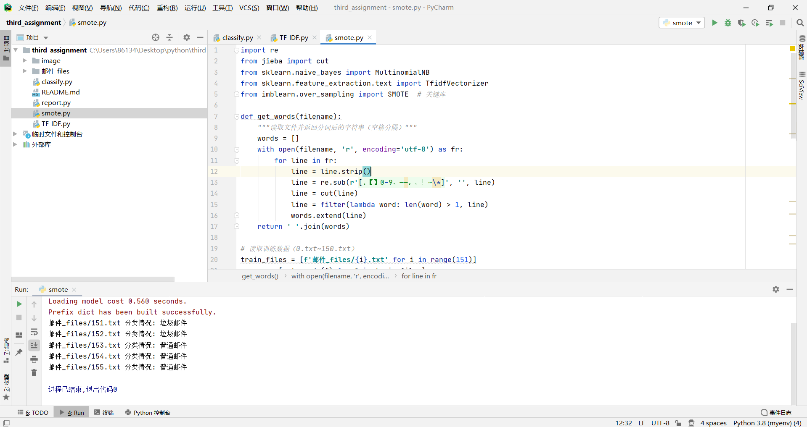

# 本仓库分别采用高频词特征、TF-IDF加权特征、样本平衡处理、增加模型评估指标进行对邮件的预测

## 代码核心功能说明:
- 算法基础：采用多项式朴素贝叶斯分类器,通过独立性假设简化联合概率计算，结合贝叶斯定理将邮件分类问题转化为概率比较问题,具体形式为： 
  $$P(y|x) = \frac{P(x|y) \cdot P(y)}{P(x)}$$
  其中：
  - $P(y|x)$是邮件内容 $x$ 属于类别 $y$ 的后验概率。
  - $P(x|y)$ 是类别 $y$ 下邮件内容 $x$ 的似然概率。
  - $P(y)$ 是类别 $y$ 的先验概率。
  - $P(x)$ 是邮件内容 $x$ 的边际概率。

- **特征独立性假设**：多项式朴素贝叶斯假设邮件中的每个词（特征）是相互独立的，即：
  
  $$P(x|y) = \prod_{i=1}^{n} P(x_i|y)$$
  
  其中 $x_i$ 表示邮件中的第 $i$ 个词。 

- 数据处理流程：使用 jieba 库进行中文分词，具体见代码中  get_words（）函数
- 特征构建过程：1.高频词特征选择：统计训练集中出现频率最高的前 N 个词，构建词频向量。
- **TF-IDF加权特征**：
   - 计算每个词的TF-IDF值，衡量词在文本中的重要性。
   - 数学表达形式：
     
        $$\text{TF-IDF}(t, d) = \mathrm{TF}(t, d) \times \mathrm{IDF}(t)$$
        
        其中：
        - $\mathrm{TF}(t, d)$ 是词 $t$ 在邮件 $d$ 中的词频。
        - $\mathrm{IDF}(t)$ 是词 $t$ 的逆文档频率，计算公式为：
          
          $$\mathrm{IDF}(t) = \log \frac{N}{1 + \mathrm{DF}(t)}$$
          
          其中 $N$ 是总邮件数， $\mathrm{DF}(t)$ 是包含词 $t$ 的邮件数。
    - 实现方式：使用 `vectorizer.fit_transform()` 计算TF-IDF值。

# 样本平衡处理和增加模型评估指标实现方式分别在smote.py和report.py

## 高频词特征运行截图如下：

## TF-IDF运行截图如下：

## 样本平衡处理运行截图如下：

## 增加模型评估指标运行截图如下：
